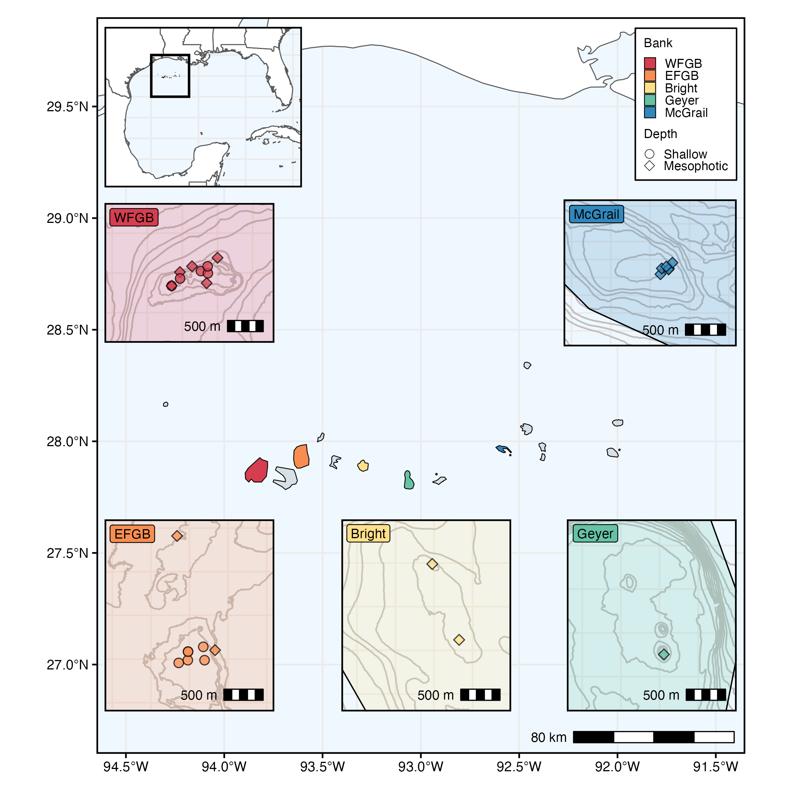
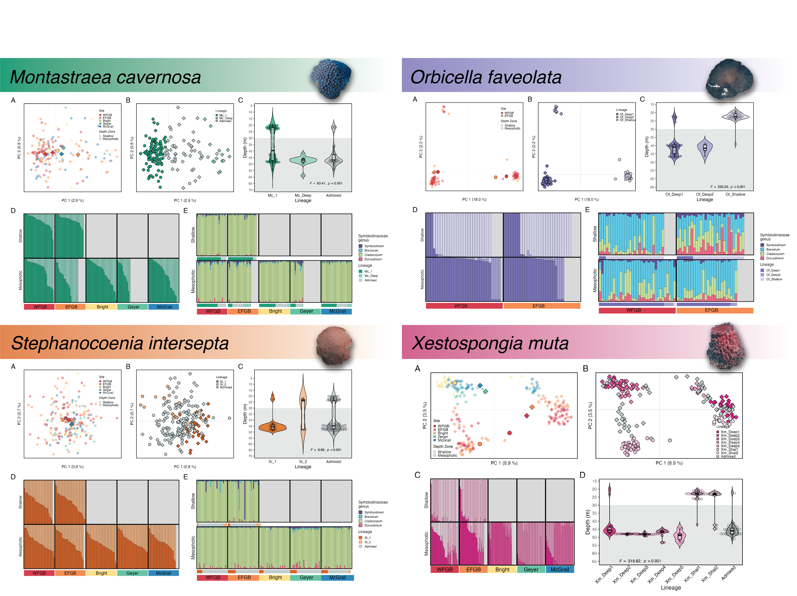

# NWGOM_PopGen
 Population genetics of benthic invertebrates in FGBNMS

### Ryan Eckert -- <ryan.j.eckert@gmail.com>
### [ryanjeckert.weebly.com](https://ryanjeckert.weebly.com)
### version: 05 May, 2025

------------------------------------------------------------------------
  

This repository contains scripts and data associated with the publication:

**[Eckert RJ, Sturm AB, Pantoni GS, Herrera S, Voss JD (in prep). Genetic insights of key habitat-forming coral and sponge populations in Flower Garden Banks National Marine Sanctuary.](https://)**

------------------------------------------------------------------------

Much of the benthic habitat in Flower Garden Banks National Marine Sanctuary (FGBNMS) falls within the mesophotic zone (30–150 m). Benthic communities in mesophotic coral ecosystems within the sanctuary are largely comprised of coral and sponge species, many of which are depth-generalists, spanning from shallow to mesophotic depths. We used 2bRAD-Seq to generate multi-locus single nucleotide polymorphism genotypes for the coral species *Montastraea cavernosa*, *Stephanocoenia intersepta*, *Orbicella faveolata*, and the sponge *Xestospongia muta* from both shallow and mesophotic habitats across multiple banks in FGBNMS. Cryptic lineages were identified in all species as well as distinct differences in population structure and genetic connectivity between species. Notably, *X. muta* and *O. faveolata* exhibit strong population demonstrated strong genetic differences across depth, while *M. cavernosa* and *S. intersepta* demonstrate greater genetic connectivity across depth and geographic space. Overall, there were not strong differences in genetic diversity among the cryptic lineages uncovered in all species, a bright spot for any potential future husbandry and restoration work in the face of change affecting coral reefs globally. These data highlight the importance of continued and effective management in a region that may be physically isolated but still maintains important local genetic diversity, emphasizing the importance of characterizing population genetic structure for multiple species.

------------------------------------------------------------------------

2bRAD Lab protocols adapted from [Misha Matz](https://docs.google.com/document/d/1am7L_Pa5JQ4sSx0eT5j4vdNPy5FUAtMZRsJZ0Ar5g9U/edit?usp=sharing)

------------------------------------------------------------------------

#### Protocols and walkthroughs accompanying this manuscript:

1.  [Protocol for DNA extraction](https://ryaneckert.github.io/labProtocols/dnaExtraction/)
2.  [Protocol for 2bRAD wet lab (based on https://github.com/z0on/2bRAD_denovo)](https://ryaneckert.github.io/labProtocols/2bRAD/)
3. [2bRAD analyses (adapted from https://github.com/z0on/2bRAD_denovo)](https://ryaneckert.github.io/NWGOM_PopGen/code/)
4.  [Statistical analysis of SNP data](https://ryaneckert.github.io/NWGOM_PopGen/data/)
5.  [Sequencing data (PRJNA1222908](https://www.ncbi.nlm.nih.gov/biosample?Db=biosample&DbFrom=bioproject&Cmd=Link&LinkName=bioproject_biosample&LinkReadableName=BioSample&ordinalpos=1&IdsFromResult=1222908) [and PRJNA1024506)](https://www.ncbi.nlm.nih.gov/biosample?Db=biosample&DbFrom=bioproject&Cmd=Link&LinkName=bioproject_biosample&LinkReadableName=BioSample&ordinalpos=1&IdsFromResult=1024506)

------------------------------------------------------------------------
